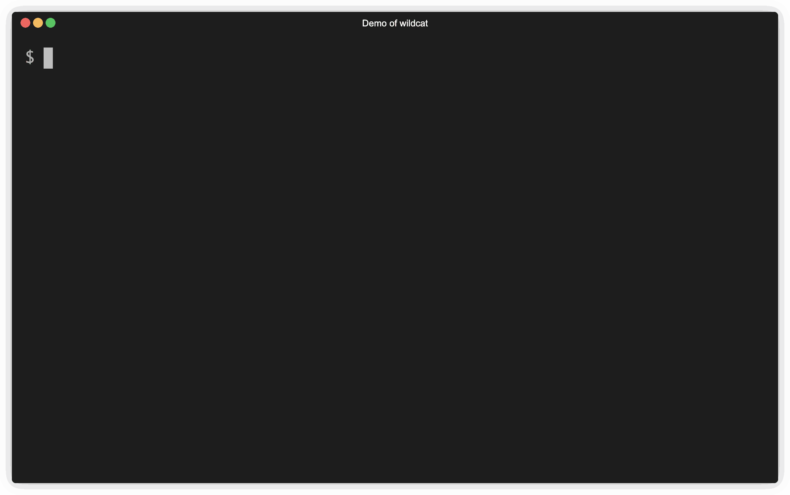

# :cat2: wildcat


[](https://coveralls.io/github/tamada/wildcat?branch=main)
[](https://codebeat.co/projects/github-com-tamada-wildcat-main)
[](https://goreportcard.com/report/github.com/tamada/wildcat)

[](https://github.com/tamada/wildcat/blob/main/LICENSE)
[](https://github.com/tamada/tjdoe/releases/tag/v1.0.3)
[](https://zenodo.org/badge/latestdoi/338797861)

[](https://github.com/users/tamada/packages/container/package/wildcat)
[](https://secret-coast-70208.herokuapp.com/wildcat/)
[](https://github.com/tamada/homebrew-brew)

[](https://github.com/tamada/wildcat/discussions)

Another implementation of `wc` (word count).


## :speaking_head: Overview

`wildcat` counts the lines, words, characters, and bytes of the given files and the files in the given directories.
Also, it respects the ignore files, such as `.gitignore`.
The excellent points than `wc` are as follows.

* handles the files in the directories,
* respects the `.gitignore` file,
* reads files in the archive file such as jar, tar.gz, and etc.,
* supports the several output formats,
* accepts file list from file and stdin, and
* includes REST API server.

Note that this product is an example project for implementing Open Source Software.

## :walking: Demo



## :runner: Usage

### :shoe: CLI mode

```shell
wildcat version 1.0.0
wildcat [CLI_MODE_OPTIONS|SERVER_MODE_OPTIONS] [FILEs...|DIRs...|URLs...]
CLI_MODE_OPTIONS
    -b, --byte                  prints the number of bytes in each input file.
    -l, --line                  prints the number of lines in each input file.
    -c, --character             prints the number of characters in each input file.
                                If the current locale does not support multibyte characters,
                                this option is equal to the -c option.
    -w, --word                  prints the number of words in each input file.
    -f, --format <FORMAT>       prints results in a specified format.  Available formats are:
                                csv, json, xml, and default. Default is default.
    -H, --humanize              prints sizes in humanization.
    -n, --no-ignore             Does not respect ignore files (.gitignore).
                                If this option was specified, wildcat read .gitignore.
    -N, --no-extract-archive    Does not extract archive files. If this option was specified,
                                wildcat treats archive files as the single binary file.
    -o, --output <DEST>         specifies the destination of the result.  Default is standard output.
    -@, --filelist              treats the contents of arguments as file list.

    -h, --help                  prints this message.
SERVER_MODE_OPTIONS
    -p, --port <PORT>           specifies the port number of server.  Default is 8080.
                                If '--server' option did not specified, wildcat ignores this option.
    -s, --server                launches wildcat in the server mode. With this option, wildcat ignores
                                CLI_MODE_OPTIONS and arguments.
ARGUMENTS
    FILEs...                    specifies counting targets. wildcat accepts zip/tar/tar.gz/tar.bz2/jar files.
    DIRs...                     files in the given directory are as the input files.
    URLs...                     specifies the urls for counting files (accept archive files).

If no arguments are specified, the standard input is used.
Moreover, -@ option is specified, the content of given files are the target files.
```

### :high_heel: Server Mode

To run `wildcat` with `--server` option, the wildcat start REST API server on port 8080 (default).
Then, `wildcat` readies for the following endpoints.

#### `POST /api/wildcat/counts`

gives the files in the request body, then returns the results in the JSON format.
The example of results is shown in [Json](#json).
Available query parameters are as follows.

* `file-name=<FILENAME>`
    * this query param gives filename of the content in the request body.
* `readAs=no-extract`
    * By specifying this query parameter, if client gives archive files, `wildcat` server does not extract archive files, and reads them as binary files.
* `readAs=file-list`
    * By specifying this query parameter, client gives url list as input for `wildcat` server.
* `readAs=no-extract,file-list` or `readAs=no-extract&readAs=file-list`
    * This query parameter means the client requests the above both parameters.
      That is, the request body is url list, and archive files in the url list are treats as binary files.
      Note that, the order of `no-extract` and `file-list` does not care.

### :envelope: Results

The available result formats are default, csv, json and xml.
The examples of results are as follows by executing `wildcat testdata/wc --format <FORMAT>`.

#### Default

Default format is almost same as the result of `wc`.

```shell
lines      words characters      bytes
    4         26        142        142 testdata/wc/humpty_dumpty.txt
   15         26        118        298 testdata/wc/ja/sakura_sakura.txt
   59        260      1,341      1,341 testdata/wc/london_bridge_is_broken_down.txt
   78        312      1,601      1,781 total
```

#### Csv

```csv
file name,lines,words,characters,bytes
testdata/wc/humpty_dumpty.txt,"4","26","142","142"
testdata/wc/ja/sakura_sakura.txt,"15","26","118","298"
testdata/wc/london_bridge_is_broken_down.txt,"59","260","1,341","1,341"
total,"78","312","1,601","1,781"
```

#### Json

The following json is formatted by `jq .`.

```JSON
{
  "timestamp": "2021-02-16T14:59:40+09:00",
  "results": [
    {
      "filename": "testdata/wc/humpty_dumpty.txt",
      "lines": "4",
      "words": "26",
      "characters": "142",
      "bytes": "142"
    },
    {
      "filename": "testdata/wc/ja/sakura_sakura.txt",
      "lines": "15",
      "words": "26",
      "characters": "118",
      "bytes": "298"
    },
    {
      "filename": "testdata/wc/london_bridge_is_broken_down.txt",
      "lines": "59",
      "words": "260",
      "characters": "1,341",
      "bytes": "1,341"
    },
    {
      "filename": "total",
      "lines": "78",
      "words": "312",
      "characters": "1,601",
      "bytes": "1,781"
    }
  ]
}
```

#### Xml

The following xml is formatted by `xmllint --format -`

```xml
<?xml version="1.0"?>
<wildcat>
  <timestamp>2021-02-16T14:58:06+09:00</timestamp>
  <results>
    <result>
      <file-name>testdata/wc/humpty_dumpty.txt</file-name>
      <lines>4</lines>
      <words>26</words>
      <characters>142</characters>
      <bytes>142</bytes>
    </result>
    <result>
      <file-name>testdata/wc/ja/sakura_sakura.txt</file-name>
      <lines>15</lines>
      <words>26</words>
      <characters>118</characters>
      <bytes>298</bytes>
    </result>
    <result>
      <file-name>testdata/wc/london_bridge_is_broken_down.txt</file-name>
      <lines>59</lines>
      <words>260</words>
      <characters>1,341</characters>
      <bytes>1,341</bytes>
    </result>
    <result>
      <file-name>total</file-name>
      <lines>78</lines>
      <words>312</words>
      <characters>1,601</characters>
      <bytes>1,781</bytes>
    </result>
  </results>
</wildcat>
```

### :whale: Docker

[](https://github.com/users/tamada/packages/container/package/wildcat)

```shell
$ docker run -v $PWD:/home/wildcat ghcr.io/tamada/wildcat:1.0.0 testdata/wc
```

If you run `wildcat` on server mode, run the following command.

```shell
$ docker run -p 8080:8080 -v $PWD:/home/wildcat ghcr.io/tamada/wildcat:1.0.0 --server
```

#### versions

* `1.0.3`, `latest`
* `1.0.2`
* `1.0.1`
* `1.0.0`

### :surfer: Heroku

[](https://secret-coast-70208.herokuapp.com/wildcat/)

Post the files to `https://secret-coast-70208.herokuapp.com/wildcat/api/counts`, like below.

```
$ curl -X POST --data-binary @testdata/archives/wc.jar https://secret-coast-70208.herokuapp.com/wildcat/api/counts
{"timestamp":"2021-02-22T02:40:26+09:00","results":[{"filename":"<request>","lines":5,"words":62,"characters":1054,"bytes":1080}]}
$ curl -X POST --data-binary @testdata/archives/wc.jar https://secret-coast-70208.herokuapp.com/wildcat/api/counts?file-name=wc.jar
{"timestamp":"2021-02-22T02:40:35+09:00","results":[{"filename":"wc.jar!humpty_dumpty.txt","lines":4,"words":26,"characters":142,"bytes":142},{"filename":"wc.jar!ja/","lines":0,"words":0,"characters":0,"bytes":0},{"filename":"wc.jar!ja/sakura_sakura.txt","lines":15,"words":26,"characters":118,"bytes":298},{"filename":"wc.jar!london_bridge_is_broken_down.txt","lines":59,"words":260,"characters":1341,"bytes":1341},{"filename":"total","lines":78,"words":312,"characters":1601,"bytes":1781}]}
```

## :anchor: Install

### :beer: Homebrew

[](https://github.com/tamada/homebrew-brew)

```shell
$ brew tap tamada/brew
$ brew install wildcat
```

### :muscle: Compiling yourself

```shell
$ git clone https://github.com/tamada/wildcat.git
$ cd wildcat
$ make
```

## :smile: About

### Cite `wildcat` in the academic papers

[](https://zenodo.org/badge/latestdoi/338797861)

To cite this product, use the following BibTeX entry.

```latex
@misc{ tamada_wildcat,
    author       = {Haruaki Tamada},
    title        = {Wildcat: another implementation of wc (word count)},
    publisher    = {GitHub},
    howpublished = {\url{https://github.com/tamada/wildcat}},
    year         = {2021},
}
```

### :jack_o_lantern: Icon


This icon is obtained from [freesvg.org](https://freesvg.org/1527045310).

### :name_badge: The project name (`wildcat`) comes from?

This project origin is `wc` command, and `wc` is the abbrev of 'word count.'

Wildcat can abbreviate as `wc`, too.

### :man_office_worker: Developers :woman_office_worker:

* [tamada](https://tamada.github.io)
